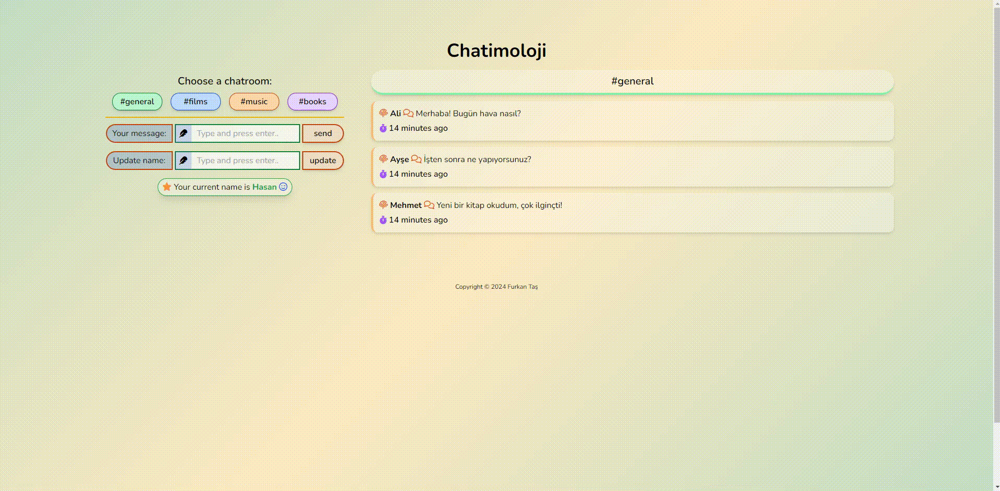
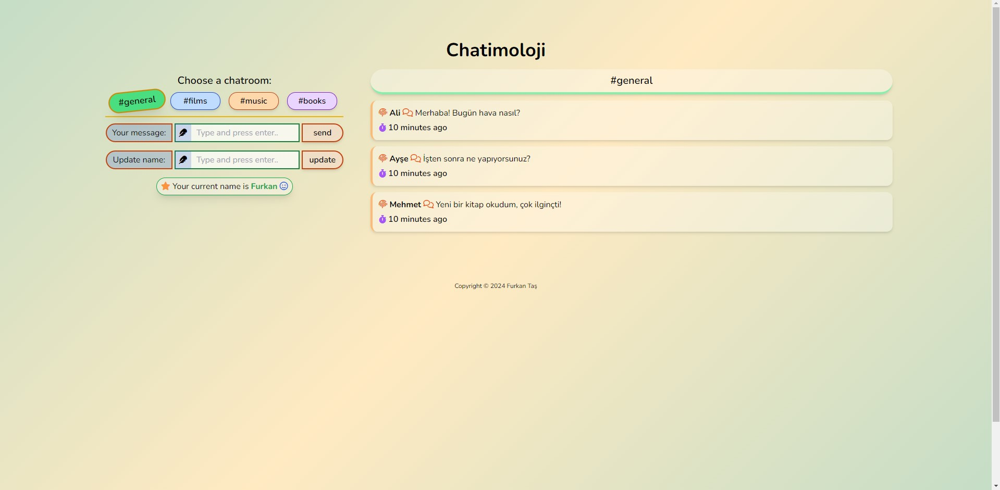
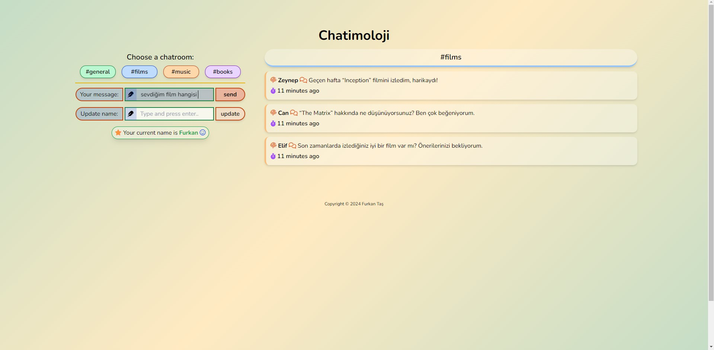
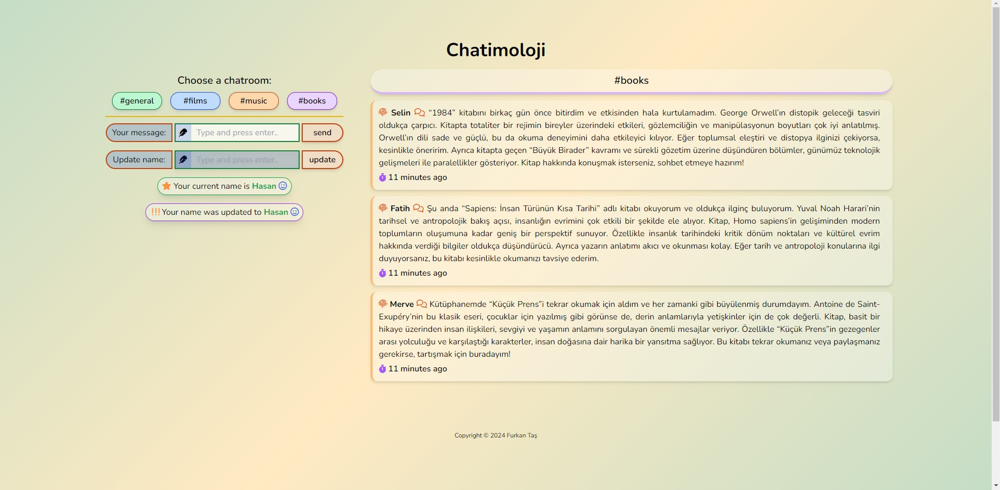

# Chatimoloji

**Chatimoloji** is a simple chat application that allows users to join various chat rooms and chat in real-time. The application uses Firebase to store data and update it dynamically.

## Features

- Ability to switch between different chat rooms.
- Update username.
- Real-time messaging.
- Display of messages with timestamp and username.

## Technologies

- HTML
- Tailwind CSS
- JavaScript
- Firebase

## Installation

### Requirements

- A Firebase account.
- A Firebase project set up.

### Steps

1. **Firebase Setup:**

   Create a Firebase project and update the `config` variable. You need to configure Firebase settings in the `app.js` file.

2. **Download Files:**

   Download the application files and place them in the root directory of your project.

3. **Include Required Libraries:**

   The `index.html` file includes necessary libraries such as Font Awesome, Google Fonts, and Firebase. Ensure that the links are up to date.

4. **Update Firebase Configuration:**

   In the `app.js` file, update the `config` variable with your Firebase project's API keys and other configuration details.

5. **Open in Browser:**

   Open the `index.html` file in a browser to run your application.

## Usage

1. **Join a Chat Room:**

   - Click on the chat room buttons on the left side of the application to join different chat rooms.

   

2. **Send a Message:**

   - Type your message and click the "send" button to send it.

   

3. **Update Username:**

   - Use the "Update name" section on the right to update your username.

   

4. **Real-Time Messages:**

   - Messages will be updated and displayed on the screen in real-time when sent.

   

## File Structure

- `index.html`: The main HTML structure of the application.
- `styles.css`: CSS file containing styles for the application.
- `scripts/chat.js`: Handles Firebase interactions and chat room management.
- `scripts/ui.js`: Manages how messages are rendered on the screen.
- `scripts/app.js`: Contains main application logic and user interactions.

## Contributing

If you would like to contribute, please submit a pull request or open an issue.

## License

This project is licensed under the MIT License - see the [LICENSE](LICENSE) file for details.

## Conclusion

Thank you for exploring the Chatimoloji chat application! We hope this tool enhances your communication experience and helps you stay connected. If you have any questions, suggestions, or feedback, please don't hesitate to open an issue or contribute to the project. Your input is highly valued!

Happy chatting!

Best regards,  
Furkan Taş
